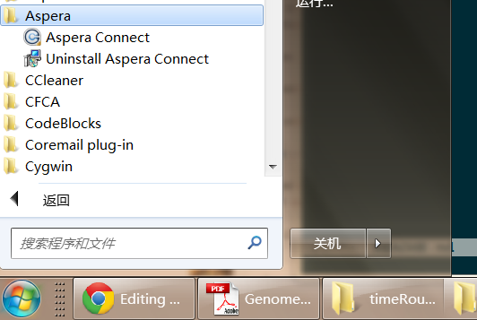
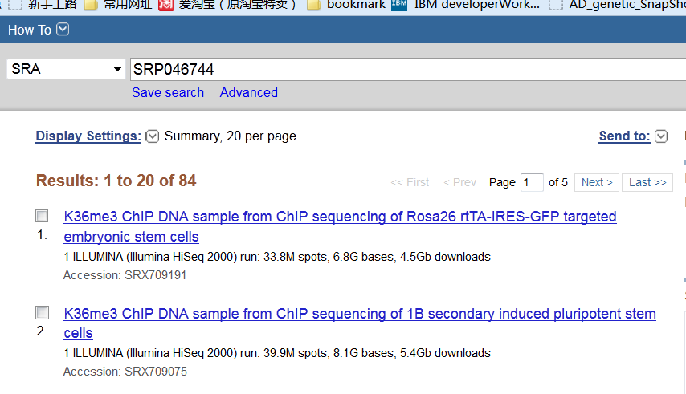
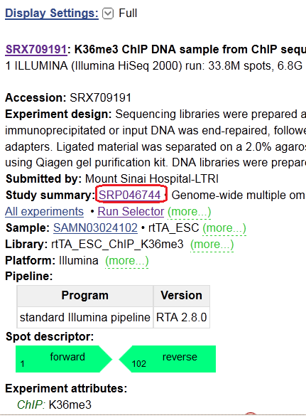
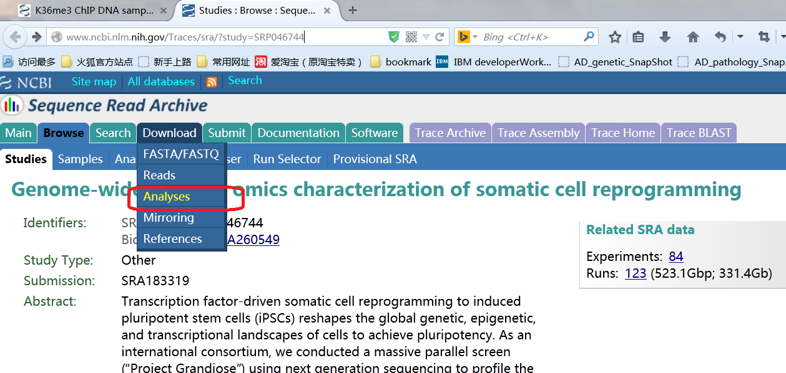
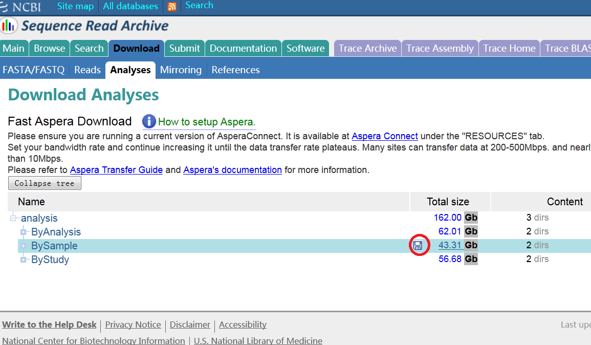
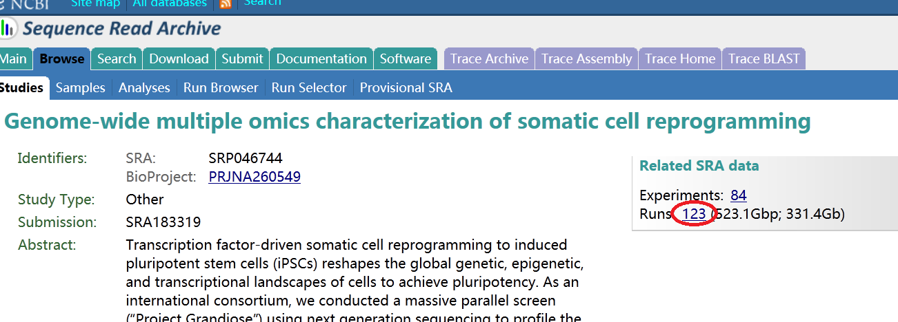
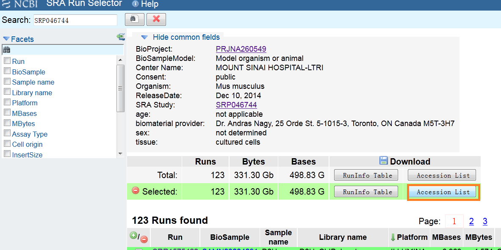
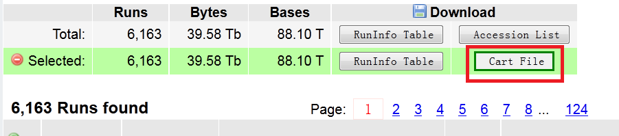
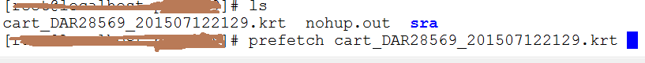

A wrapper shell script for NCBI sra(sequence read achieve) data download 

A large part of the publicly available sequencing data are stored in NCBI sra database. in order to download these data, you need a file down loader with higher speed than common down loaders. Aspera is a software that is employed by NCBI which facilitate the file downloading speed...

After installed on the local computer, sra file download can be issued via the firefox aspera connect plug-in or just be invoked in the terminal.

###download via firefox plug-in###
First make sure that aspera connect has been installed on your local computer. at the time of this tutorial was written, aspera connect for windows is on its version 3.6.0  
  
With a successful installation of aspera connect plug-in, open sra website with firefox browser, and navigate to an sra data file. This can be done by typing in the study accession number of the data you are interested in and search it against NCBI sra database which is illustrate as bellow:
  
By click on one resulting entry, we are brought to a page which shows the basic sample information such as the sequencing data platform, experiment design, number of spots in this sample etc... Clicking on the red labeled link in the picture below will bring you to the sra trace page, from there you can invoke your aspera connect and download the data...
  
when you get to this page move on to click the red colored link shown in the picture below...
  
The collpased tree is where we are heading for.  
  
By click on the save icon labeled with the red circle, you will invoke the aspera connect download plug-in. It is to be noted that now downloading in this way is of limited used because original data was found to be missing as in my opinion, maybe NCBI is encouraging us to download via its own tools: sra-toolkit  

###download via sratoolkit###
sratoolkit is developed by NCBI. it can be used to compress original sequencing data to a compressed for with a .sra suffix and vice versa. with fastq-dump, you can get the fastq read data from an sra compress file. moreover, sratoolkit has a utility called prefetch, it can be used to download sra read files as is shown below...
first make sure that you have installed the sratoolkit.
Again you type in an accession number and searched it against the sra database. you repeat the steps showed in pic1, pic2 and pic3. now click on the number of the runs:
  
you will find that you are navigated to the run selector page. The download operation differs depending on whether you are downloading public accessed data or protected data. for publicly accessed data, just select data and download the accession List which is orange colored in the pic below.
  
With the accession list downloaded , you can issue the downloading process by:

     while read acc
     do
     prefetch $acc
     done <Acclist.txt

One more thing before you can use the prefetch command in the code above is that you have to setup the working directory of sratool kit by `vdb-config -i` command.  For publicly available data, downloading process can be issued anywhere in you file system, the data downloaded will be stored in workdir/public/sra/. But for protected data, issuing the download command outside of the working dir is forbidden and will fail.  
For protected data, there is a little bit difference. First you will find there be a kart file download button in the page describe above.
  
you need to download this file and feed this kart file to prefetch to initiate the download process:

prefetch command makes the downloading process more easily. but it has disadvantages: you have to setup the workdir before use it. all downloaded files will be put there. If you want to download several datasets into their corresponding dirs at the same time, you need to use the ascp command directly.

###use ascp directly to download the sra data files###
ascp is the binary file of the aspera connect software package. it is available under both Win/Linux/MacOS. ascp command is used like this:

     ascp [options] source_url target_dir

as you can see, in order to use ascp directly, you have to know the downloading url first. fortunately, there is a [documentation page](http://www.ncbi.nlm.nih.gov/books/NBK158899/#SRA_download.accessing_the__ascp_utility) on NCBI which illuminate this. the ascp.sh is a wrapper shell script that does the url logic for you. you simply tell it the accession number file and it helps to deduce the right download url and issue the ascp command to download the data. you can use it like this:

   sh ascp.sh AccList.txt 1>ascp.out 2>ascp.err

one more thing to say is that NCBI sra database and sratool kit are both under extensive change, the procedure mentioned above may be deprecated providing that the database or tools interface is changed substantially.  

That's it, enjoy!